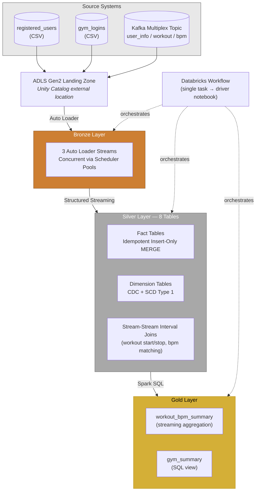
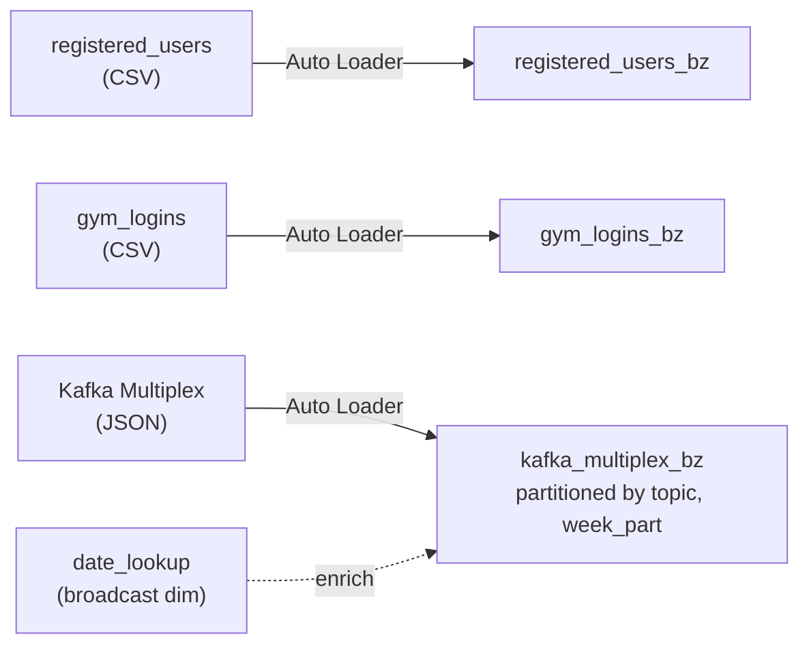
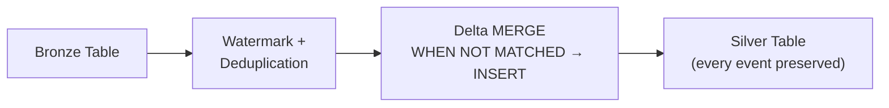
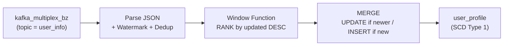
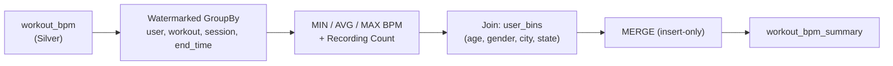
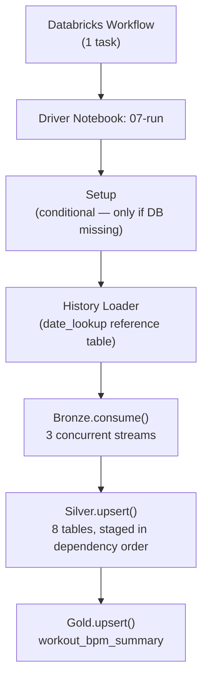

# Azure Databricks Fitness Data Engineering Pipeline

An end-to-end **Lakehouse data engineering pipeline** built on **Azure Databricks**, implementing the **Medallion Architecture** (Bronze → Silver → Gold) to ingest, transform, govern, and analyze fitness data from relational (CSV) and Kafka streaming sources.

The pipeline ingests user registrations, gym logins, and a multiplexed Kafka topic (user profile CDC, workout events, heart-rate telemetry), applies deduplicated and time-bound streaming transformations, and produces session-level analytics — orchestrated end-to-end through a single Databricks Workflow job.

---

## Tech Stack

| Technology | Purpose |
|---|---|
| **Azure Databricks** | Core data engineering and processing platform |
| **Delta Lake** | ACID-compliant transactional storage layer |
| **Databricks Auto Loader** | Incremental, schema-defined file ingestion (`cloudFiles`) |
| **Spark Structured Streaming** | Streaming ingestion, joins, and aggregation |
| **PySpark / Spark SQL** | Transformation, CDC, and aggregation logic |
| **Unity Catalog** | External locations, governed storage access |
| **ADLS Gen2** | Cloud storage / landing zone |
| **Databricks Workflows** | Scheduled job orchestration |
| **Databricks Jobs REST API** | Programmatic job creation for automated stream testing |

---

## Architecture Overview



---

## Project Goals

- Decouple data collection from downstream processing via a cloud storage landing zone
- Incrementally ingest newly arriving data without reprocessing committed files
- Support both batch (CSV) and streaming (Kafka) source types through one framework
- Correctly distinguish **append-only event data** from **mutable dimension data** and apply the right merge strategy to each
- Guarantee idempotent, reliable processing under repeated or replayed runs
- Bound streaming state on unbounded data using event-time watermarks
- Fully automate and test the pipeline end-to-end, including simulated incremental data arrival

---

## Bronze Layer — Incremental Ingestion

Three concurrent Auto Loader streams ingest raw data into Bronze Delta tables, each run in its own **Spark scheduler pool** so they execute in parallel within the same job rather than queued sequentially.



- **Kafka multiplex pattern**: a single Bronze table holds all three Kafka topics (`user_info`, `workout`, `bpm`), partitioned by `topic` and `week_part` — a standard pattern for consolidating heterogeneous event streams behind one ingestion path instead of building a separate pipeline per topic
- Each Kafka record is enriched at ingestion time with a **broadcast join** against a `date_lookup` dimension table to derive its partition key from the event timestamp
- Auto Loader (`cloudFiles`) applies a defined schema per source and tracks file-discovery state via checkpoint, so re-running never reprocesses already-ingested files
- Supports both **one-time batch** (`trigger(availableNow=True)`) and **continuous** (`trigger(processingTime=...)`) execution modes, selected by a run-time parameter

---

## Silver Layer — Transformation

Eight Silver tables fall into two distinct categories, each requiring a different merge strategy — a distinction the pipeline handles explicitly rather than applying one merge pattern everywhere:

### Fact / event tables — idempotent insert-only MERGE

`users`, `gym_logs` *(partial update)*, `workouts`, `heart_rate`, `completed_workouts`, `workout_bpm`



Since these represent discrete events (a login, a heartbeat reading, a workout action) rather than mutable entity state, the MERGE only ever inserts unseen records — matching rows are left untouched. This makes reprocessing safe (no duplicate events on reruns) while naturally preserving the full transaction/event history, since nothing is ever overwritten.

`gym_logs` is a partial exception: it inserts new login records but conditionally **updates** the `logout` timestamp when a later logout is observed for the same session — handling out-of-order or multi-event logout reporting.

### Dimension tables — CDC and SCD Type 1

**`user_profile`** implements genuine **Change Data Capture**: incoming Kafka records carry an explicit `update_type` field (`new`/`update`) from the source system. A custom `CDCUpserter` uses a **window function** (`RANK() OVER (PARTITION BY user_id ORDER BY updated DESC)`) to resolve the single most recent change per user within each micro-batch before merging — preventing out-of-order updates within a batch from being applied incorrectly. The MERGE then updates the current row only if the incoming record is newer (`a.updated < b.updated`), making this an **SCD Type 1** dimension: current state is always accurate, but prior states are not retained as separate rows.

**`user_bins`** is a derived SCD Type 1 dimension — computed from `user_profile` (age bucketed from date of birth, joined with gym/city/state) and fully overwritten on match.



### Stream-stream interval joins

**`completed_workouts`** and **`workout_bpm`** are both built from **stream-to-stream joins with time-bound conditions** — a more advanced streaming pattern than a simple stream-to-static join:

- `completed_workouts` joins `workout` start events to `workout` stop events for the same session, constrained to a 3-hour window, to synthesize a single completed-session record from two separate events
- `workout_bpm` joins `completed_workouts` to `heart_rate` readings, keeping only BPM readings that fall between a session's start and end time

Both joins use **watermarks on each side** to bound state and allow Spark to safely evict old unmatched records rather than buffering them indefinitely.

---

## Gold Layer — Analytical Datasets



- **`workout_bpm_summary`**: a streaming aggregation over `workout_bpm`, grouped by session and enriched with demographic attributes from `user_bins`. Since a completed workout session's BPM stats never change once calculated, the MERGE is insert-only — a new session is written once and never touched again.
- **`gym_summary`**: a SQL view (not a materialized table) joining `gym_logs` with `completed_workouts` to compute minutes spent in the gym vs. minutes actually exercising per visit — a lightweight analytical layer built directly on Silver/derived data without a separate streaming job.

---

## Orchestration

The full pipeline runs as a **single Databricks Workflow task** pointing at one driver notebook (`07-run`), which internally sequences every stage:



- Run-time parameters (`Environment`, `RunType`, `ProcessingTime`) select the target catalog and switch between **one-time batch mode** (`availableNow`) and **continuous streaming mode**
- Silver transformations are internally staged in three dependency-respecting groups (independent tables first, then tables that depend on them like `user_bins` and `completed_workouts`, then `workout_bpm` which depends on both), with the driver notebook awaiting each group's stream termination before starting the next
- Session-level Spark configs are set once per run: shuffle partition count, Delta auto-compaction/optimize-write, and the **RocksDB state store provider** for more efficient streaming state management
- Per-table **checkpoint locations** allow every stream to resume independently after a failure without reprocessing committed data

---

## Automated Pipeline Testing

The project includes two dedicated test harnesses that exercise the full pipeline end-to-end rather than relying on manual verification:

- **`08-batch-test`**: cleans the environment, runs the full pipeline once in batch mode, then uses a `Producer` class to simulate two waves of newly arriving source files (registrations, gym logins, Kafka events). After each wave, it re-runs the pipeline and asserts exact record counts across every Bronze, Silver, and Gold table to confirm incremental ingestion and idempotent merging both work correctly.
- **`09-stream-test`**: creates a real Databricks Job via the **Jobs REST API**, launches the pipeline in continuous streaming mode, and validates that data produced mid-run is correctly picked up by the running micro-batches — then tears the job down automatically.

---

## Governance & Configuration

A shared `Config` class resolves storage paths from **Unity Catalog external locations** (`data_zone`, `checkpoint`) rather than hardcoding cloud storage paths in any notebook, so the same code runs unchanged across environments/catalogs (`dev`, `prod`) passed in as a run-time parameter.

---

## Project Structure

```text
.
├── 01-Config              → Resolves external locations, shared settings
├── 02-Setup                → Database + table DDL, validation, cleanup
├── 03-history-loader        → Reference/date_lookup table loading
├── 04-bronze                → 3 concurrent Auto Loader ingestion streams
├── 05-silver                → 8 tables: fact MERGE, CDC/SCD1, interval joins
├── 06-gold                  → workout_bpm_summary aggregation
├── 07-run                   → Driver notebook — orchestrates 02 through 06
├── 08-batch-test             → End-to-end batch test harness
├── 09-stream-test             → End-to-end streaming test harness (Jobs API)
└── 10-producer               → Simulates incremental source-file arrival
```

---

## Key Engineering Concepts Demonstrated

`Medallion Architecture` · `Delta Lake / ACID transactions` · `Databricks Auto Loader` · `Spark Structured Streaming` · `Kafka topic multiplexing` · `Idempotent insert-only MERGE` · `Change Data Capture (CDC)` · `SCD Type 1 dimensions` · `Stream-to-stream interval joins` · `Event-time watermarking` · `Window functions for CDC ordering` · `Concurrent stream execution (scheduler pools)` · `Unity Catalog external locations` · `Databricks Workflows` · `Automated end-to-end pipeline testing`

---

## Future Improvements

- Add SCD Type 2 historization for `user_profile` to preserve prior states, not just current
- Split orchestration into a true multi-task Workflow DAG with per-stage retry policies and monitoring
- Add a BI/dashboard layer on top of Gold datasets
- Expand automated data-quality coverage (schema drift detection, anomaly checks)
- Introduce CI/CD with separate dev/prod deployment pipelines
- Add pipeline performance monitoring and cost optimization

---

## Author

Built as a hands-on exploration of modern Lakehouse data engineering on Azure Databricks — covering incremental ingestion, CDC, stream-to-stream joins, idempotent merge strategies, and automated end-to-end pipeline testing.
